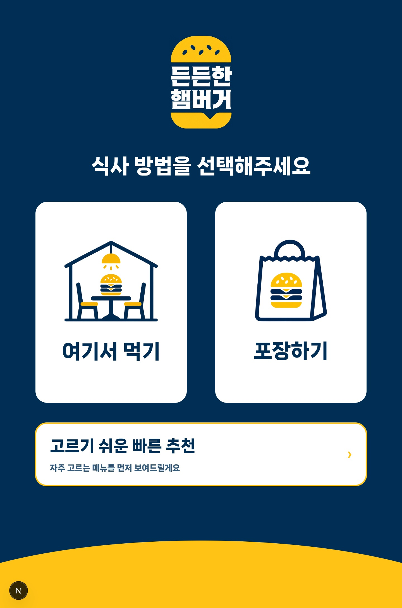
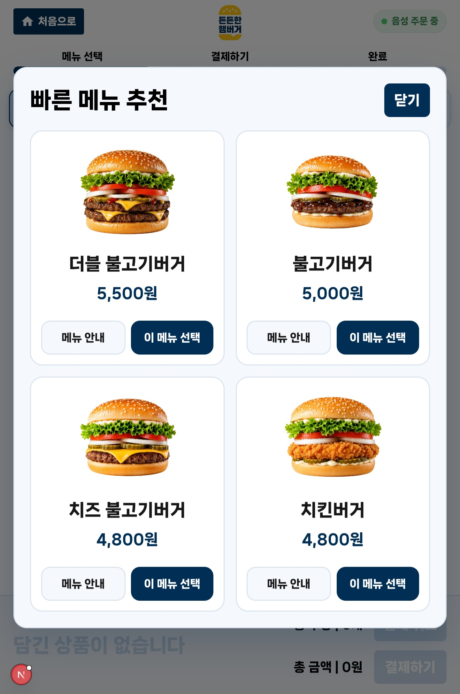
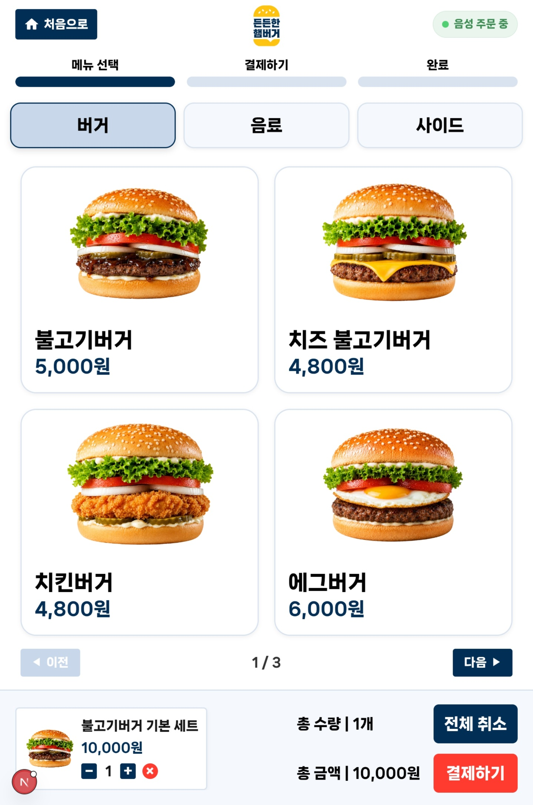
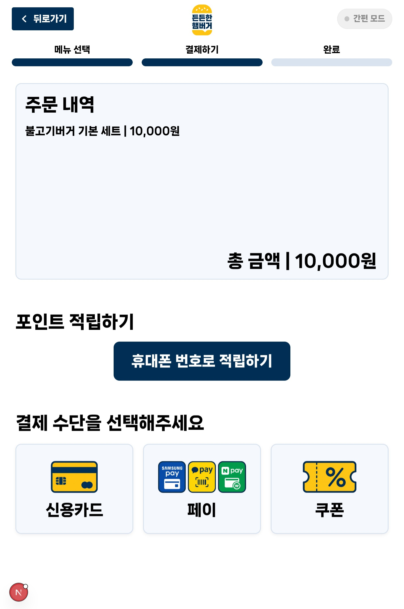

# Conversational Senior Kiosk

> 시니어 사용자가 더 쉽고 편하게 주문할 수 있도록 설계한 음성 기반 키오스크 웹 서비스


---

## 프로젝트 소개

**Conversational Senior Kiosk**는 기존 키오스크 사용이 어렵게 느껴질 수 있는 시니어 사용자를 위해 만든 주문 서비스입니다.

이 프로젝트는 단순히 메뉴를 보여주는 데서 끝나지 않고,

- 큰 버튼으로 쉽게 누를 수 있게 하고
- 음성 안내로 다음 행동을 이해하기 쉽게 만들고
- 빠른 추천 흐름으로 선택 부담을 줄이는 것

에 초점을 맞췄습니다.

즉, "주문 기능"보다 **접근성과 사용 경험**을 더 중심에 둔 키오스크 프로젝트입니다.

---

## 프로젝트 한눈에 보기

| 항목 | 내용 |
|---|---|
| 프로젝트 유형 | 시니어 친화형 키오스크 주문 웹앱 |
| 핵심 목표 | 고령층 사용자의 주문 부담 완화 |
| 프론트엔드 | Next.js 15, React 19 |
| 백엔드 | Express |
| 데이터베이스 | MySQL |
| AI / 음성 | OpenAI API, Web Speech API, TTS |

---

## 화면 미리보기

<table>
  <tr>
    <td align="center"><br><strong>메인 화면</strong></td>
    <td align="center"><br><strong>빠른 메뉴 추천</strong></td>
  </tr>
  <tr>
    <td align="center"><br><strong>메뉴 화면</strong></td>
    <td align="center"><br><strong>결제 화면</strong></td>
  </tr>
</table>

---

## 문제의식

기존 키오스크는 빠르게 주문하는 데 초점이 맞춰져 있지만,  
시니어 사용자 입장에서는 다음과 같은 불편이 크게 느껴질 수 있습니다.

- 한 화면에 선택지가 너무 많음
- 글자가 작고 정보가 복잡함
- 무엇을 먼저 눌러야 하는지 직관적이지 않음
- 실수했을 때 다시 돌아가기가 부담스러움
- 사람들 앞에서 천천히 조작하기 어려움

이 프로젝트는 이런 문제를 줄이기 위해 **더 단순하고, 더 명확하고, 더 안내적인 흐름**으로 설계되었습니다.

---

## 주요 기능

### 1. 음성 기반 주문 보조

- 음성으로 메뉴 탐색 가능
- OpenAI 기반 주문 해석
- TTS 기반 음성 안내 제공

### 2. 시니어 친화형 UI

- 큰 버튼 중심 레이아웃
- 단계별로 명확한 선택지 제공
- 복잡한 정보보다 핵심 행동 중심 구성

### 3. 빠른 메뉴 추천 흐름

- 메인 화면에서 빠르게 추천 흐름 진입 가능
- 추천 전 `여기서 먹기 / 포장하기` 선택
- 대표 버거 4종을 2x2 카드 형태로 비교 가능

### 4. QR 진입 지원

- 키오스크 모드 주문 지원
- QR 기반 모바일 진입 흐름 지원

### 5. 전체 주문 플로우 구성

- 메뉴 조회
- 옵션 선택
- 장바구니 반영
- 전화번호 / 포인트 입력
- 결제 전 단계까지 연결

---

## 사용자 흐름

```text
메인 화면
 -> 여기서 먹기 / 포장하기
 -> 빠른 메뉴 추천 또는 전체 메뉴
 -> 메뉴 옵션 선택
 -> 전화번호 / 포인트
 -> 결제
```

---

## 기술 스택

| 영역 | 사용 기술 |
|---|---|
| Frontend | Next.js 15, React 19, Tailwind CSS 4 |
| Backend | Node.js, Express |
| Database | MySQL, mysql2/promise |
| Voice | Web Speech API, OpenAI TTS |
| AI | OpenAI API |
| Tooling | npm, concurrently, ESLint |

---

## 시스템 구조

```text
Next.js UI
   -> API Proxy (/api/voice-order)
Express Server
   -> OpenAI (주문 해석 / TTS)
   -> MySQL (메뉴 / 장바구니 / 주문 관련 데이터)
```

---

## 폴더 구조

```text
src/
  app/
    (home)/         # 메인 진입 화면
    menu/           # 메뉴 목록 / 빠른 추천 / 음성 주문
    menu-option/    # 옵션 선택
    points/         # 전화번호 / 포인트 입력
    payment/        # 결제 화면
    qr-order/       # QR 진입 흐름
  components/       # 공통 UI 컴포넌트

server/
  routes/           # Express API 라우트
  db/               # DB 스키마 및 시드 SQL

public/             # 이미지 및 정적 리소스
docs/
  images/           # README용 화면 이미지
```

---

## API 요약

기본 Express 포트는 `3001`입니다.

- `POST /api/voice-order`
  음성/텍스트 기반 주문 해석
- `GET /api/menu`
  메뉴 목록 조회
- `POST /api/cart`
  장바구니 저장
- `GET /api/cart/:sessionId`
  장바구니 조회
- `POST /api/tts`
  음성 안내 생성
- `GET /health`
  서버 상태 확인

---

## 실행 방법

### 1. 패키지 설치

```bash
npm install
```

### 2. 환경변수 파일 생성

프로젝트 루트에 `.env.local` 또는 `.env`를 생성합니다.

```env
EXPRESS_PORT=3001
EXPRESS_API_URL=http://localhost:3001

DB_HOST=127.0.0.1
DB_PORT=3306
DB_USER=root
DB_PASSWORD=your_password
DB_NAME=senior_kiosk

OPENAI_API_KEY=sk-...
OPENAI_TTS_VOICE=nova
OPENAI_TTS_SPEED=0.95
```

### 3. 데이터베이스 설정

```bash
mysql -u root -p
```

```sql
CREATE DATABASE senior_kiosk CHARACTER SET utf8mb4 COLLATE utf8mb4_unicode_ci;
```

스키마와 메뉴 시드 데이터를 적용합니다.

```bash
mysql -u root -p senior_kiosk < server/db/schema.sql
mysql -u root -p senior_kiosk < server/db/add_drinks_sides_menu.sql
```

### 4. 프로젝트 실행

프론트엔드와 백엔드를 동시에 실행:

```bash
npm run dev:all
```

개별 실행:

```bash
npm run dev
npm run server
```

---

## 로컬 접속 주소

- 프론트엔드: [http://localhost:3000](http://localhost:3000)
- 백엔드: [http://localhost:3001](http://localhost:3001)
- 헬스체크: [http://localhost:3001/health](http://localhost:3001/health)

같은 와이파이에 연결된 태블릿이나 모바일에서 테스트할 때는 PC의 로컬 IP를 사용하면 됩니다.

예시:

```text
http://192.168.0.28:3000
```

---

## 포트폴리오 포인트

이 프로젝트는 포트폴리오에서 다음 강점을 보여줄 수 있습니다.

- 접근성 중심 UX 설계
- 프론트엔드, 백엔드, DB, AI API를 연결한 풀스택 구현
- 실제 키오스크 상황을 고려한 서비스 설계
- 음성 안내와 추천 흐름을 결합한 사용자 경험 설계
- 특정 사용자군(시니어)을 위한 문제 해결형 프로젝트

---

## 향후 개선 방향

- 실제 시니어 사용자 테스트 기반 개선
- 추천 로직 고도화
- 결제 연동 강화
- 주문 이력 기반 개인화 기능
- 관리자용 메뉴 / 주문 관리 대시보드

---

## 관련 문서

- [README_SETUP.md](./README_SETUP.md)
- [DEVELOPMENT.md](./DEVELOPMENT.md)
- [TTS_SETUP.md](./TTS_SETUP.md)
